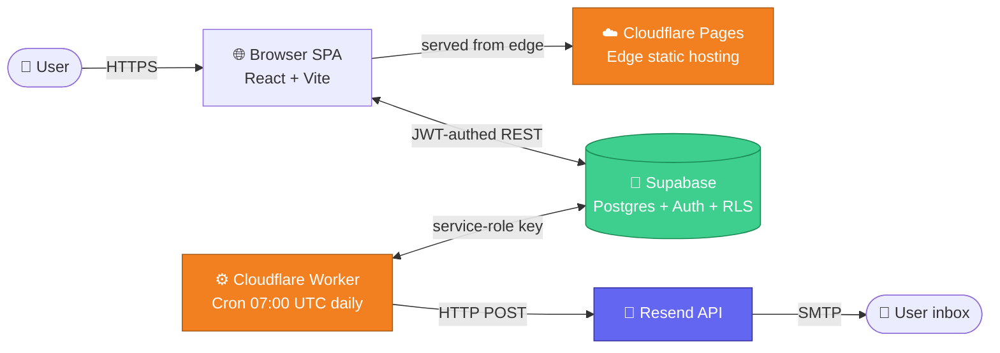
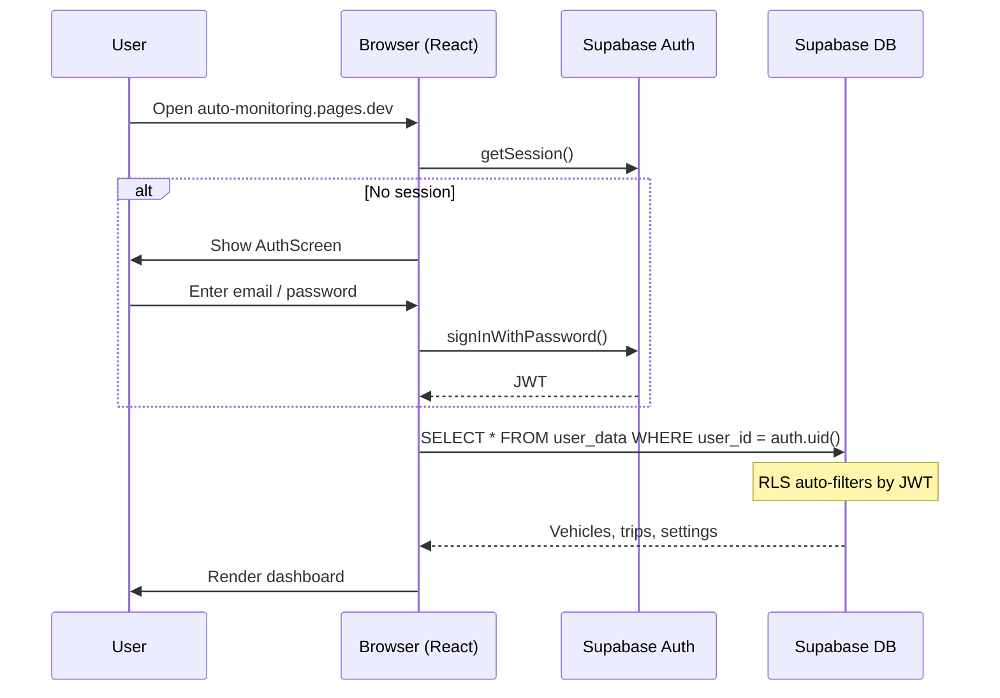
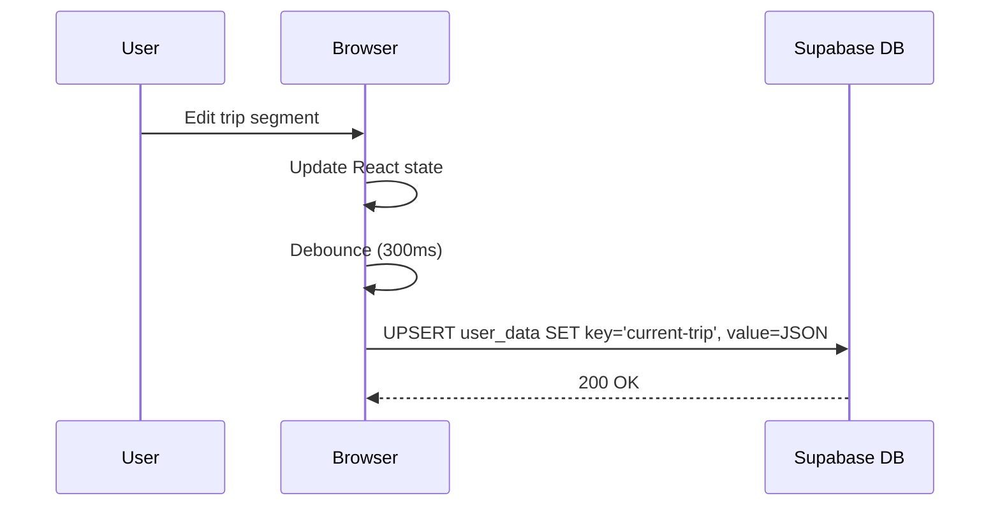
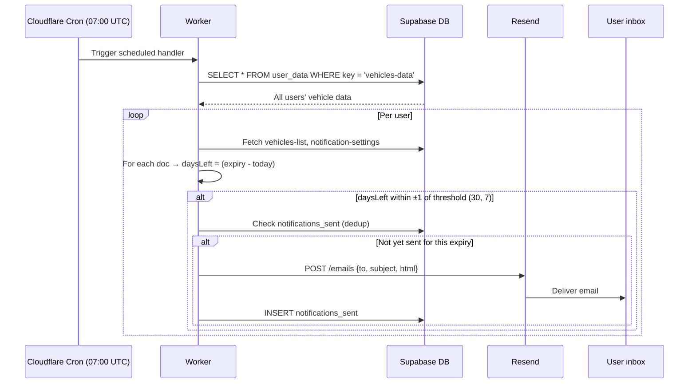

# 🚗 Auto Monitoring

> Multi-tenant web app for managing a personal vehicle fleet, tracking document expiration dates, and calculating trip costs — with automated email reminders.

[](https://auto-monitoring.pages.dev)
[]()
[](./LICENSE)

**🌐 Live demo:** https://auto-monitoring.pages.dev

---

## What it does

Auto Monitoring is a personal vehicle management tool that solves three real-world problems:

1. **Trip cost calculator** — split fuel expenses among passengers, handle multiple refuelings per trip, support multi-currency (CZK/EUR), live exchange rate from the Czech National Bank.
2. **Document expiration tracking** — keep tabs on STK (Czech technical inspection), liability insurance, and highway vignette renewals. Just enter the issue date — the app auto-calculates expiration based on Czech regulations (STK +2y for cars, +4y for trailers; insurance +1y; vignette +1y).
3. **Automated email reminders** — receive proactive notifications **30 and 7 days** before any document expires (configurable). A daily cron scans every user's data and dispatches summary emails.

The app is **multi-tenant**: each user has their own private fleet, isolated via Postgres Row-Level Security. No shared data, no cross-user leaks.

---

## Features

| Feature | Details |
|---------|---------|
| 🛣️ **Trip calculator** | Multiple route segments, mid-trip top-ups, per-passenger cost split, EUR/CZK conversion with cached CNB rate |
| 🚗 **Vehicle fleet** | Add cars and trailers, configure STK validity (2 or 4 years), toggle vignette tracking |
| 📅 **Expiration tracking** | Color-coded warnings (`Zbývá X dní`), one-click document update via inline modal |
| 📊 **Dashboard** | KPI cards, monthly trends, top 10 trips, fuel-type pie chart, per-vehicle breakdown |
| 📥 **CSV export** | Filtered trip history exportable to CSV (Czech format with `;` separator and BOM for Excel) |
| 📧 **Email notifications** | Configurable thresholds (default 30 + 7 days), per-document-type opt-out, sent via Resend |
| 🔐 **Auth** | Email/password or passwordless magic link (Supabase Auth) |
| 📱 **Mobile-first** | Optimized for phones — every screen is touch-friendly |
| 💾 **Auto-save** | Every change persists to Postgres in real time |
| 🇨🇿 **Czech UI** | Built for the Czech market with localized terms (STK, dálniční známka, etc.) |

---

## Architecture

### High-level system diagram



### Tech stack

**Frontend**
- ⚛️ **React 18** — component model with hooks
- ⚡ **Vite** — dev server + production build
- 🎨 **TailwindCSS** — utility-first styling
- 📊 **Recharts** — D3-based charting
- 🎯 **Lucide React** — icon set
- 🌗 **Bebas Neue + DM Sans** — typography (Google Fonts)

**Backend / Data**
- 🐘 **Supabase Postgres** — primary store, all user data
- 🔐 **Supabase Auth** — email/password + OTP magic links
- 🛡️ **Row-Level Security** — strict per-user data isolation, enforced by Postgres
- 📦 **Key-value pattern** in `user_data` — flexible schema-less storage per user

**Infrastructure**
- ☁️ **Cloudflare Pages** — global edge hosting + GitHub auto-deploy on push
- ⚙️ **Cloudflare Workers** — serverless cron with `0 7 * * *` schedule
- 📧 **Resend** — transactional email delivery
- 🐙 **GitHub** — source control + CI trigger
- 🔧 **Wrangler** — Cloudflare CLI for Worker deploys

---

## Data flows

### 1) User session bootstrap



### 2) Trip auto-save



### 3) Daily notification cron



---

## Database schema

```sql
-- Generic key-value store: one row per (user, key) tuple
CREATE TABLE user_data (
  user_id    UUID NOT NULL REFERENCES auth.users(id) ON DELETE CASCADE,
  key        TEXT NOT NULL,
  value      JSONB NOT NULL,
  updated_at TIMESTAMPTZ DEFAULT NOW(),
  PRIMARY KEY (user_id, key)
);

-- RLS: each user only sees/edits their own rows
ALTER TABLE user_data ENABLE ROW LEVEL SECURITY;
CREATE POLICY "user_data_isolation" ON user_data
  FOR ALL USING (auth.uid() = user_id);

-- Deduplication table for the notification worker
CREATE TABLE notifications_sent (
  id          BIGSERIAL PRIMARY KEY,
  user_id     UUID NOT NULL,
  vehicle_id  TEXT NOT NULL,
  doc_type    TEXT NOT NULL,
  expiry_date DATE NOT NULL,
  days_ahead  INT  NOT NULL,
  sent_at     TIMESTAMPTZ DEFAULT NOW(),
  UNIQUE (user_id, vehicle_id, doc_type, expiry_date, days_ahead)
);
```

### Key conventions in `user_data`

| Key | Value shape | Purpose |
|-----|-------------|---------|
| `vehicles-list` | `[{id, name, type, defaultFuel, stkYears, ...}]` | Fleet metadata (one array per user) |
| `vehicles-data` | `{vehicleId: {stk: {from}, insurance: {from}, vignette: {from}}}` | Document issue dates |
| `notification-settings` | `{enabled, email, daysBefore: [30, 7], docTypes: {...}}` | User preferences |
| `current-trip` | `{items: [...], participants}` | Active calculator state |
| `saved-trips` | `[{id, name, items, ...}]` | Trip history |
| `eur-rate-cache` | `{rate, fetchedAt}` | CNB exchange-rate cache |

---

## Project structure

```
auto-monitoring/
├── src/                       # React frontend (single-file SPA)
│   ├── App.jsx                # ~3500 lines: state, components, render
│   ├── supabase.js            # Supabase client + storage abstraction
│   ├── main.jsx               # ReactDOM.createRoot bootstrap
│   └── index.css              # Tailwind directives
├── supabase/
│   └── schema.sql             # DB schema + RLS policies
├── worker/                    # Cloudflare Worker (notifications)
│   ├── src/
│   │   ├── index.js           # Cron handler + /run endpoint
│   │   └── notifier.js        # Core logic: scan → match → send
│   ├── wrangler.toml          # Worker config + cron trigger
│   └── package.json
├── index.html                 # Vite entry
├── vite.config.js
├── tailwind.config.js
├── postcss.config.js
├── package.json
├── README.md                  # This file
├── DEPLOYMENT.md              # Detailed deployment guide (Czech)
├── CHECKLIST.md               # Quick deployment checklist (Czech)
└── LICENSE                    # MIT
```

---

## Local development

### Prerequisites
- Node.js 18+
- npm
- A free Supabase project

### Setup

```bash
# Clone
git clone https://github.com/JakubT91/auto-monitoring.git
cd auto-monitoring

# Install
npm install

# Configure environment
cp .env.example .env
# Edit .env:
#   VITE_SUPABASE_URL=https://your-project.supabase.co
#   VITE_SUPABASE_ANON_KEY=sb_publishable_...

# Initialize database
# → Open Supabase SQL Editor, paste contents of supabase/schema.sql, Run

# Run dev server
npm run dev
# Opens http://localhost:5173
```

### Build

```bash
npm run build      # production build → dist/
npm run preview    # serve dist/ locally
```

---

## Deployment

Production runs on three free-tier services and takes ~10 minutes end-to-end:

1. **Supabase** — managed Postgres + Auth
2. **Cloudflare Pages** — static hosting with auto-deploy on `main` branch push
3. **Cloudflare Worker + Resend** — daily cron + email delivery

📋 **See [`CHECKLIST.md`](./CHECKLIST.md) for the step-by-step deployment guide** (in Czech).

### Required environment variables

**Cloudflare Pages** (frontend):
- `VITE_SUPABASE_URL` — your Supabase project URL
- `VITE_SUPABASE_ANON_KEY` — Supabase publishable key (safe for browser, RLS protects data)

**Cloudflare Worker secrets** (notifications backend):
- `SUPABASE_URL`
- `SUPABASE_SERVICE_ROLE_KEY` — ⚠️ secret, bypasses RLS for the cron scan
- `RESEND_API_KEY`
- `FROM_EMAIL` — e.g. `Auto monitoring <onboarding@resend.dev>`
- `APP_URL` — e.g. `https://auto-monitoring.pages.dev`
- `MANUAL_TRIGGER_KEY` — secret for the manual `/run?key=...` endpoint

---

## Security model

| Layer | Mechanism |
|-------|-----------|
| **Authentication** | Supabase Auth (JWT, bcrypt-hashed passwords, OTP magic links) |
| **Authorization** | Postgres RLS enforces `auth.uid() = user_id` on every query, every row |
| **Frontend secrets** | Only the **publishable** Supabase key reaches the browser; RLS protects data even if the key leaks |
| **Worker secrets** | The **service-role** key lives only in Cloudflare Worker secrets, never in source or frontend |
| **Cron access** | `/run` endpoint requires `MANUAL_TRIGGER_KEY` query param |
| **Email rate limit** | Resend free tier caps at 100 emails/day per sender — sufficient for personal use |

---

## How the notification worker decides

For each document (STK / insurance / vignette):

1. Compute expiration: `expiryDate = issueDate + statutoryYears`
   - Cars: STK +2y, Trailers: STK +4y, Insurance/Vignette: +1y
2. Compute `daysLeft = round((expiryDate − today) / 86_400_000)`
3. For each threshold in `settings.daysBefore` (default `[30, 7]`):
   - If `|daysLeft − threshold| ≤ 1`, queue a notification
   - The ±1-day tolerance handles timezone offsets and missed cron days
4. Before sending, check `notifications_sent` — skip if already delivered for this `(user, vehicle, doc, expiry, threshold)` tuple
5. Send **one summary email** per user per run (multiple expiring docs are bundled into a single mail)

---

## What I learned building this

- **Multi-tenant from day one is much cheaper than retrofitting it.** I started with hard-coded vehicle defaults and had to refactor the entire data model when adding auth.
- **Supabase RLS is genuinely magical** — once policies are written, the frontend never has to think about user isolation again. Queries just work, secured at the DB layer.
- **Cloudflare's free tier is wild.** Pages with auto-deploy from GitHub, Workers with cron, edge cache — all $0/month.
- **Cron edge cases bite.** Initially the worker only matched expirations exactly N days ahead. A timezone offset of just a few hours meant docs were skipped on the boundary day. ±1-day tolerance + a dedup table fixed it cleanly.
- **Sandboxed iframes hate `<form>`.** Refactored three modals from `<form onSubmit>` to plain `<div>` + `onClick` to make the app preview-able in restricted contexts.
- **A flexible JSONB key-value table beats designing 6 different schemas upfront** when you're still iterating on features. Trade-off: less SQL-friendly analytics later.

---

## Roadmap

- [ ] Service interval reminders (oil change every 15 000 km, etc.)
- [ ] Receipt photo attachments via Supabase Storage
- [ ] Multi-driver / shared-fleet mode
- [ ] PWA offline support
- [ ] Custom domain + branded `noreply@…` sender
- [ ] Mobile push notifications (FCM)
- [ ] i18n: English UI

---

## Credits

Built with ❤️ in the Czech Republic.

- **React, Vite, Tailwind, Recharts, Lucide** — open-source ecosystems
- **Supabase** — backend platform
- **Cloudflare Pages + Workers** — hosting & edge compute
- **Resend** — email delivery
- **Czech National Bank** — public exchange-rate API

---

## License

MIT — see [`LICENSE`](./LICENSE) for full text.

---

**🔗 Live demo:** https://auto-monitoring.pages.dev  
**📦 Source:** https://github.com/JakubT91/auto-monitoring
